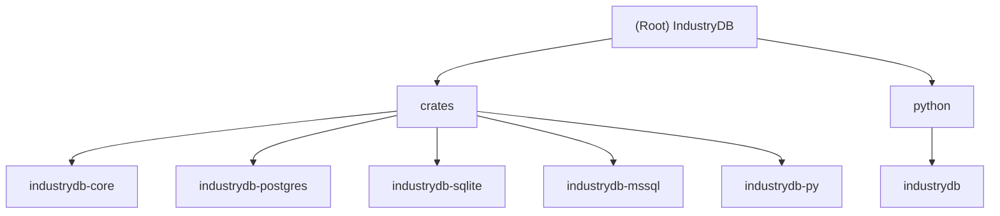

# IndustryDB - AI Context Documentation

## Change Log

### 2025-11-04 18:11:48 - Initial Documentation
- Created comprehensive AI context documentation
- Documented multi-crate architecture
- Added module structure and navigation
- Documented core abstractions and database implementations
- Included Python bindings documentation

---

## Project Vision

IndustryDB is a high-performance database middleware powered by Rust and Polars, providing a unified interface for PostgreSQL, SQLite, and MSSQL databases with zero-copy data transfer and comprehensive Python bindings. The project emphasizes:

- **Performance**: Rust-based implementation with zero-copy data transfer via Apache Arrow
- **Modularity**: Multi-crate architecture with clear separation of concerns
- **Type Safety**: Trait-based abstractions and comprehensive type stubs for Python
- **Developer Experience**: Simple, Pythonic API with excellent IDE support
- **Extensibility**: Easy to add new database backends

## Architecture Overview

IndustryDB follows a layered multi-crate architecture:

```
┌─────────────────────────────────────────┐
│  Python Layer (User Interface)          │
│  - Simple Pythonic API                  │
│  - Type hints & IDE support             │
└──────────────┬──────────────────────────┘
               │ PyO3 Bindings
┌──────────────▼──────────────────────────┐
│  industrydb-py (Binding Layer)          │
│  - Factory pattern connector creation   │
│  - Exception mapping                    │
│  - DataFrame conversion                 │
└──┬──────────┬──────────┬────────────────┘
   │          │          │
   ▼          ▼          ▼
┌─────────┬─────────┬─────────┐
│postgres │ sqlite  │  mssql  │ Database
│connector│connector│connector│ Implementation
└────┬────┴────┬────┴────┬────┘ Layer
     └──────────┼─────────┘
                │
     ┌──────────▼──────────┐
     │ industrydb-core     │ Core Abstractions
     │ - Traits            │ - DatabaseConnector
     │ - Config types      │ - CrudOperations
     │ - Error handling    │ - OperationResult
     └─────────────────────┘
```

## Module Structure Diagram



## Module Index

| Module | Path | Language | Responsibility |
|--------|------|----------|----------------|
| **Core Abstractions** | `crates/industrydb-core` | Rust | Defines traits, config types, and error handling |
| **PostgreSQL Connector** | `crates/industrydb-postgres` | Rust | PostgreSQL implementation via sqlx |
| **SQLite Connector** | `crates/industrydb-sqlite` | Rust | SQLite implementation via sqlx |
| **MSSQL Connector** | `crates/industrydb-mssql` | Rust | MSSQL implementation via tiberius |
| **Python Bindings** | `crates/industrydb-py` | Rust | PyO3 bindings exposing Rust to Python |
| **Python Package** | `python/industrydb` | Python | Python utilities and configuration helpers |

## Running and Development

### Quick Start

```bash
# Setup environment
just setup
source .venv/bin/activate

# Install dependencies and build
just sync
just develop

# Run tests
just test

# Run examples
just example
```

### Development Workflow

```bash
# Fast development cycle
just dev              # fmt + check + develop

# Complete CI checks
just ci               # fmt + lint + test

# Build release wheel
just wheel
```

### Common Commands

| Command | Description |
|---------|-------------|
| `just setup` | Create virtual environment |
| `just sync` | Sync Python dependencies |
| `just develop` | Build and install in development mode |
| `just test` | Run all tests (Rust + Python) |
| `just lint` | Run all linters |
| `just fmt` | Format all code |
| `just clean` | Clean build artifacts |
| `just doc` | Generate Rust documentation |

### System Dependencies

**Ubuntu/Debian:**
```bash
sudo apt-get install libkrb5-dev libssl-dev build-essential
```

**macOS:**
```bash
brew install krb5 openssl
```

See [BUILD.md](BUILD.md) for detailed build instructions.

## Testing Strategy

### Rust Tests
- **Unit tests**: Each crate has internal unit tests
- **Location**: Inline `#[cfg(test)]` modules in source files
- **Run**: `cargo test --workspace`

### Python Tests
- **Integration tests**: End-to-end testing via Python API
- **Location**: `tests/test_basic.py`
- **Run**: `pytest tests/ -v`
- **Coverage**: `pytest --cov=industrydb --cov-report=html`

### Test Markers
- `unit`: Unit tests
- `integration`: Integration tests
- `slow`: Slow-running tests

## Coding Standards

### Rust Code
- **Formatter**: `cargo fmt` (rustfmt)
- **Linter**: `cargo clippy -- -D warnings`
- **Edition**: 2021
- **Style**: Follow [Rust API Guidelines](https://rust-lang.github.io/api-guidelines/)

### Python Code
- **Formatter**: `ruff format`
- **Linter**: `ruff check`
- **Type checker**: `mypy`
- **Line length**: 100 characters
- **Target**: Python 3.8+

### Conventions
- **Error handling**: Use `Result<T>` in Rust, raise typed exceptions in Python
- **Async**: Use async/await for all database operations
- **Naming**: Snake_case for Rust, snake_case for Python
- **Documentation**: Rustdoc for Rust, docstrings for Python

## AI Usage Guidelines

### Working with Code

1. **Understanding architecture**: Start with this document, then dive into module-level CLAUDE.md files
2. **Adding features**:
   - For new database types: Create new crate implementing traits in `industrydb-core`
   - For new operations: Extend traits in core, implement in all connectors
   - For Python API: Update `industrydb-py` bindings and type stubs

3. **Debugging**: Check error propagation chain from Rust Result to Python exceptions

### Code Generation

When generating code:
- Follow existing trait implementations as templates
- Maintain async/await patterns consistently
- Update type stubs (.pyi) when modifying Python bindings
- Add unit tests in the same module

### Testing Guidelines

- Always add tests for new features
- Use `tmp_path` fixture for database tests
- Mock external database connections where appropriate
- Test error conditions and edge cases

### Documentation Updates

When making changes:
1. Update relevant module-level CLAUDE.md
2. Update this root CLAUDE.md if architecture changes
3. Update README.md for user-facing changes
4. Add changelog entry at top of this file

## Key Design Patterns

### Trait-Based Abstraction
All database connectors implement `DatabaseConnector` and `CrudOperations` traits, enabling polymorphism and testability.

### Factory Pattern
`industrydb-py` uses factory pattern to create appropriate connector based on database type in configuration.

### Error Handling
Structured error types propagate from Rust (`IndustryDbError`) to Python exceptions via PyO3 conversion.

### Zero-Copy Transfer
Data flows via Apache Arrow format, avoiding serialization overhead between Rust and Python.

## Project Structure

```
industrydb/
├── Cargo.toml              # Rust workspace definition
├── pyproject.toml          # Python package configuration
├── justfile                # Development automation
├── crates/                 # Rust crates
│   ├── industrydb-core/    # Core abstractions
│   ├── industrydb-postgres/# PostgreSQL connector
│   ├── industrydb-sqlite/  # SQLite connector
│   ├── industrydb-mssql/   # MSSQL connector
│   └── industrydb-py/      # Python bindings
├── python/                 # Python source
│   └── industrydb/         # Python package
├── tests/                  # Python integration tests
├── examples/               # Usage examples
├── README.md               # User documentation
├── ARCHITECTURE.md         # Architecture details
└── BUILD.md                # Build instructions
```

## External Dependencies

### Rust Dependencies
- **polars**: DataFrame library (v0.44)
- **sqlx**: PostgreSQL and SQLite driver (v0.8)
- **tiberius**: MSSQL driver (v0.12)
- **pyo3**: Python bindings (v0.21)
- **tokio**: Async runtime (v1.0)

### Python Dependencies
- **polars**: DataFrame library (>=0.19.0)
- **maturin**: Build tool (>=1.0)
- **pytest**: Testing framework
- **ruff**: Linter and formatter
- **mypy**: Type checker

## Performance Characteristics

- **Zero-copy**: Data transfer via Arrow format
- **Parallel**: ConnectorX enables parallel query execution
- **Lazy**: Polars supports lazy evaluation
- **Compiled**: Release builds use LTO and optimization level 3

## Future Roadmap

### Phase 1 (Current)
- Multi-crate architecture
- Basic CRUD operations
- Three database backends

### Phase 2 (Planned)
- Full parameter binding support
- Transaction support
- Connection pooling

### Phase 3 (Future)
- Async Python API
- Additional databases (MySQL, Oracle)
- Query builder

## Related Documentation

- [README.md](README.md) - User guide and quick start
- [ARCHITECTURE.md](ARCHITECTURE.md) - Detailed architecture (Chinese)
- [BUILD.md](BUILD.md) - Build instructions and troubleshooting
- [examples/quickstart.py](examples/quickstart.py) - Usage examples

## Support and Contributing

- **Issues**: [GitHub Issues](https://github.com/yourusername/industrydb/issues)
- **License**: MIT
- **Version**: 0.1.0 (Alpha)
